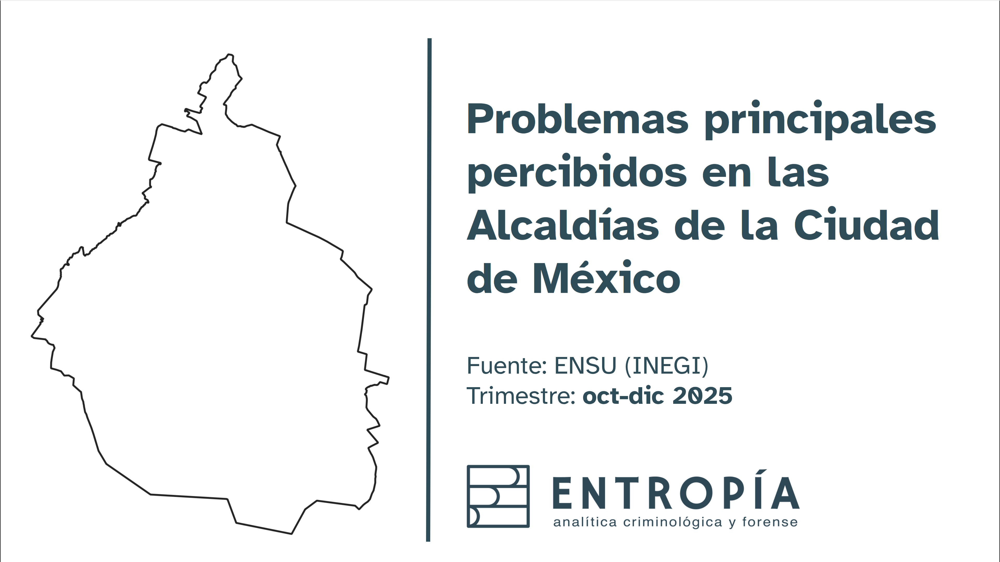

# Hola, soy Isaías Morales 🥷🏾

Analista de datos con experiencia en estadística, análisis geoespacial, calidad de datos y automatización de reportes.  
Trabajo con datos para convertir procesos complejos en productos claros, útiles y reproducibles.

## Tecnologías y herramientas

## Áreas de trabajo

- Estadística aplicada
- Ciencia y análisis de datos
- Visualización de información
- Sistemas de información geográfica
- Automatización de reportes y pipelines
- Optimizo procesos

## Proyectos destacados

### 1. [Reporte ENSU](https://github.com/IsaiasEntropia/reporte-ensu)
Pipeline de procesamiento y creación automatizada de reporte sobre la ENSU con Python.

## Actualmente me interesa

- Integración de estadística, SIG y backend
- Diseño de portafolios analíticos reproducibles
- Arquitectura y calidad de datos
- Automatización de productos analíticos

## GitHub Stats

## Contacto

¿Tienes un problema de datos con impacto social? colaboremos!

- [Ver LinkedIn](https://www.linkedin.com/in/isa%C3%ADas-morales-78843b10a/)
- imorales.entropia@gmail.com 